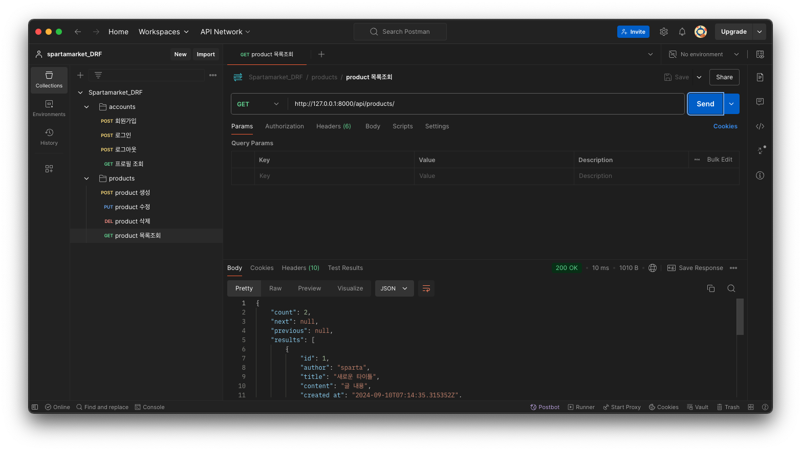

# spartamarket_DRF
이 프로젝트는 사용자 인증과 상품 관리를 위한 기능을 포함하고 있으며 API는 사용자 회원가입, 로그인, 프로필 관리 및 상품 관련 CRUD 작업을 지원한다. 

---
## API

### **회원가입**
- **Endpoint**: `/api/accounts`
- **Method**: `POST`
- **설명**: 사용자가 계정을 등록할 수 있다.
- **요청 본문**:
    - **필수 입력 필드**: `username`, `password`, `email`, `name`, `nickname`, `birthday`
    - **선택 입력 필드**: `gender`, `bio`
- **검증**:
    - `username`과 `email`은 유일해야 한다.
    - 이메일 중복 검증 옵션 제공.
- **응답**: 데이터 검증 후 유효한 경우 사용자 정보가 데이터베이스에 저장된다.

### **로그인**
- **Endpoint**: `/api/accounts/login`
- **Method**: `POST`
- **설명**: 사용자가 로그인하여 인증 토큰을 발급받을 수 있다.
- **요청 본문**:
    - **필수 입력 필드**: `username`, `password`
- **검증**:
    - 입력한 사용자명과 비밀번호는 데이터베이스 기록과 일치해야 한다.
- **응답**: 성공적으로 로그인할 경우 인증 토큰이 반환되며, 실패 시 에러 메시지가 반환된다.

### **로그아웃**
- **Endpoint**: **`/api/accounts/logout`**
- **Method**: **`POST`**
- **조건**: 로그인 상태에서만 사용 가능.
- **구현**: 사용자의 refresh token을 받아 해당 토큰을 블랙리스트에 등록하여 로그아웃 처리.

### **프로필 조회**
- **Endpoint**: `/api/accounts/<str:username>`
- **Method**: `GET`
- **설명**: 사용자가 자신의 프로필 정보를 조회할 수 있다.
- **조건**: 로그인한 상태여야 한다.
- **검증**: 로그인한 사용자만 자신의 프로필을 조회할 수 있다.
- **응답**: 사용자의 프로필 정보를 JSON 형식으로 반환한다.

--- 
### **상품 등록**
- **Endpoint**: `/api/products`
- **Method**: `POST`
- **설명**: 로그인한 사용자가 새로운 상품을 등록할 수 있다.
- **요청 본문**:
    - **필수 입력 필드**: `title`, `content`, `image`
- **응답**: 상품이 성공적으로 등록되면 데이터베이스에 저장된다.

### **상품 목록 조회**
- **Endpoint**: `/api/products`
- **Method**: `GET`
- **설명**: 모든 사용자가 상품 목록을 조회할 수 있다.
- **응답**: 상품 목록이 반환된다.

### **상품 수정**
- **Endpoint**: `/api/products/<int:productId>`
- **Method**: `PUT`
- **설명**: 로그인한 사용자가 자신이 등록한 상품을 수정할 수 있다.
- **조건**: 요청자는 상품의 작성자와 일치해야 한다.
- **응답**: 입력된 정보로 기존 상품 정보가 업데이트된다.

### **상품 삭제**
- **Endpoint**: `/api/products/<int:productId>`
- **Method**: `DELETE`
- **설명**: 로그인한 사용자가 자신이 등록한 상품을 삭제할 수 있다.
- **조건**: 요청자는 상품의 작성자와 일치해야 한다.
- **응답**: 해당 상품이 데이터베이스에서 삭제된다.

